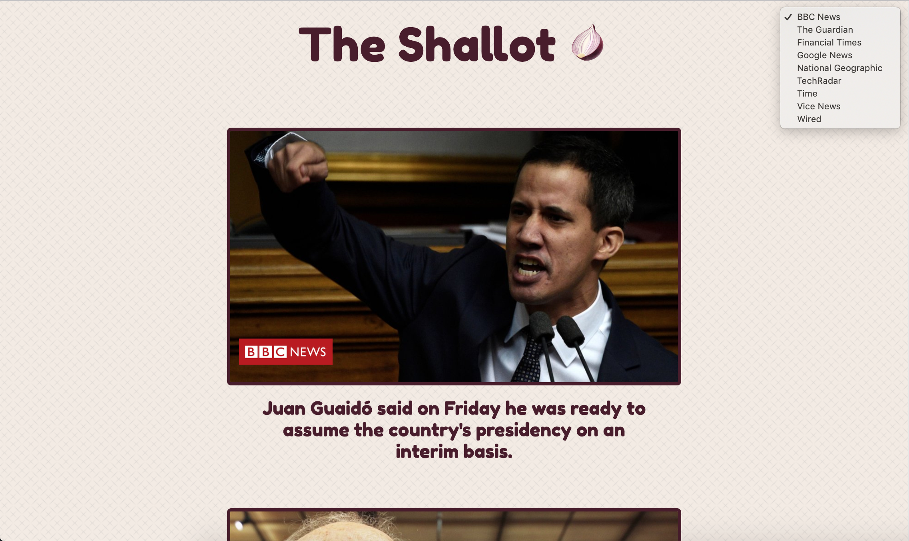

# The Shallot in React [](https://travis-ci.org/jebax/TheShallotReact) [](https://codecov.io/gh/jebax/TheShallotReact) [](https://codeclimate.com/github/jebax/TheShallotReact/maintainability)
*The Shallot* is a single-page news summary app, using the [News API](https://newsapi.org/) to fetch news headlines and thumbnails. Clicking on a headline will display a short summary of the article (using the [Aylien Summarization API](https://aylien.com/text-api/summarization/)), and then clicking on the headline again will link the user to the original article. The user can switch between various news sources using a dropdown box in the top right corner (defaults to BBC News).

This is a React re-imagining of [this](https://github.com/jebax/TheShallotSummary) vanilla JS project. After learning how amazing React is for creating single-page apps, I decided I had to give this a go!

I use Travis for CI; a production build is available here: http://the-shallot.surge.sh/.

## My approach
I used a test-driven approach for this project, with Jest, Enzyme, and Cypress as my testing technologies. This is also my first project paying special attention to React best practices (as of Dec 2018) such as functional components and PropTypes, after diving head-first into the framework in previous projects.

## Installation
- Clone the repository
- `npm install` inside the project directory
- `npm start` to run a development build on `http://localhost:3000/`
- `npm test` to run unit tests (Jest / Enzyme)
- `npm test -- --coverage` to view unit test coverage
- `npx cypress open` to run integration tests (Cypress)

This project requires a [News API key](https://newsapi.org/), an [Aylien Summarization API key](https://aylien.com/text-api/summarization/) (and the related app ID), and local environment files for the React app and the Cypress tests.

To set up local environment files, add the following in the project's root directory:

#### `.env.development.local`, `.env.test.local`

```
REACT_APP_NEWS_KEY=yourkeygoeshere
REACT_APP_AYLIEN_KEY=yourkeygoeshere
REACT_APP_AYLIEN_ID=yourappidgoeshere
```

#### `cypress.env.json`

```
{
  "guardianUrl": "`https://newsapi.org/v2/top-headlines?sources=the-guardian-uk&apiKey=yourkeygoeshere",
  "aylienUrl": "https://cors-anywhere.herokuapp.com/https://api.aylien.com/api/v1/summarize?url=http://localhost:3000/TestUrl"
}
```

## Screenshots

Main articles list, using News API to fetch results from BBC News:


The user can choose between various news sources in the right-hand corner:


Article summary page, using Aylien Summarization API:

